# ER Diagram — Recruitment Institute Database

## Entity Relationship Diagram (Mermaid)

```mermaid
erDiagram
    course_category {
        int course_category_id PK
        string course_category
        string course_href_tag
        datetime cr_date
    }

    courses {
        int id PK
        string title
        text description
        int course_category_id FK
        int total_stud
        decimal rating
        string review
        string course_by
        date Date
        datetime created
    }

    expert {
        int e_id PK
        string title
        string prof
        string image
        int course_category_id FK
    }

    fees {
        int id PK
        string course
        int course_category_id FK
        decimal fees
        decimal discount
        decimal total
        decimal fee_total
        decimal subtotal
        decimal finaltotal
        string coupon_code
    }

    reviews {
        int id PK
        string title
        text description
        int rating
        string review
        int course_category_id FK
    }

    faq {
        int f_id PK
        text question
        text answer
        datetime created
        int course_category_id FK
    }

    faq_category {
        int id PK
        string title
    }

    blog {
        int blog_id PK
        string blog_title
        string title_url
        text blog_desc
        string blog_date
        string blog_by
        string meta_title
        text meta_keyword
        text meta_desc
        string meta_canonical_href
        string item_image
        tinyint status
        datetime created
    }

    about_us {
        int about_us_id PK
        string image
        string title
        string title1
        text description
        datetime created
    }

    registers {
        int user_id PK
        string Name
        string Mobile
        string email
        string password
        datetime created_at
    }

    questions {
        int id PK
        int user_id FK
        text question
        datetime created_at
    }

    answers {
        int id PK
        int question_id FK
        int user_id FK
        text answer
        datetime created_at
    }

    knowledge_items {
        int question_id PK
        text question
        text answer
        string date
        string added_by
        datetime created_at
    }

    user_admin {
        int user_admin_id PK
        string name
        string m_name
        string l_name
        string email
        string contact
        string password
        int role
        string image
        tinyint status
        datetime created_at
    }

    candidate_login {
        int id PK
        string name
        string mobile
        string email
        string password
        date birthdate
        string gender
        text address
        string city
        string state
        string course_select
        text comments
        int accept_signin
        datetime created_at
    }

    login_student {
        int s_id PK
        string name
        string contact
        string email
        string password
        tinyint status
        datetime created
    }

    login_membership {
        int m_id PK
        string name
        string contact
        string email
        string password
        tinyint status
        datetime created
    }

    tbl_contactus {
        int id PK
        string name
        string email
        string message
        string mobile
        datetime created
    }

    subscribe_email {
        int mail_id PK
        string email
        string ip_address
        tinyint status
        datetime created
    }

    course_leads {
        int v_id PK
        string name
        string lname
        string email
        string contact
        string flag
        datetime created
    }

    fees_leads {
        int fv_id PK
        string name
        string lname
        string email
        string contact
        date visitor_date
        string flag
        datetime created
    }

    study_with_us {
        int study_id PK
        string image
        string title
        text description
    }

    services {
        int id PK
        string title
        string title_url
        text description
        string image
        tinyint status
        datetime created
    }

    testimonials {
        int id PK
        string title
        text description
        string author
        string image
        int rating
        tinyint status
        datetime created
    }

    news {
        int id PK
        string title
        string title_url
        text description
        string image
        tinyint status
        datetime created
    }

    course_category ||--o{ courses : "has"
    course_category ||--o{ expert : "has"
    course_category ||--o{ fees : "has"
    course_category ||--o{ reviews : "has"
    course_category ||--o{ faq : "has"
    registers ||--o{ questions : "posts"
    registers ||--o{ answers : "writes"
    questions ||--o{ answers : "receives"
```



---

## Relationship Summary

### Core Course Structure
```
course_category (1:N) courses
course_category (1:N) expert
course_category (1:N) fees
course_category (1:N) reviews
course_category (1:N) faq
```

### Community Structure
```
registers (1:N) questions
registers (1:N) answers
questions (1:N) answers
```

### Independent Entities
- `blog` — standalone blog posts
- `about_us` — about us sections
- `knowledge_items` — admin-managed knowledge base
- `user_admin` — admin staff
- `candidate_login` — candidates awaiting approval
- `login_student` — registered students
- `login_membership` — membership users
- `tbl_contactus` — contact form submissions
- `subscribe_email` — newsletter subscribers
- `course_leads` — course inquiry visitors
- `fees_leads` — fees inquiry visitors
- `study_with_us` — homepage marketing content
- `services` — services (referenced in code, added)
- `testimonials` — testimonials (referenced in code, added)
- `news` — news (referenced in code, added)
