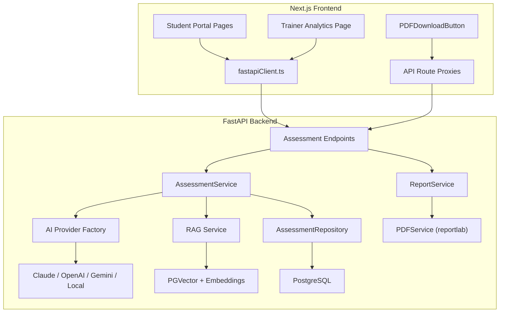

# AI-Powered Student Assessment System — Walkthrough

## Overview

This walkthrough covers the complete AI-Powered Student Assessment, Notes & Study Plan module built across the **FastAPI backend** and **Next.js frontend** of the Recruitment Institute platform.

## 5. Student Test-Taking Flow (New)
Added a fully integrated UI for students to take assessments directly from their dashboard:
- **Profile Integration**: Once a student completes a course (100% of sessions are in the past or marked completed), a prominent **"Take Final Assessment"** button appears in their "My Training" panel.
- **Dedicated Quiz UI**: Created a modern, timed test-taking interface at `/profile/assessments/take/[courseId]`.
  - Features a sidebar for tracking answered/unanswered questions.
  - Implements a real-time countdown timer.
  - Interactive selection UI.
- **Next.js Proxy Routes**: Added three new proxy routes to securely pipe requests to the FastAPI backend without exposing the HTTP-only session cookie:
  - `GET /api/assessment/course/[courseId]` (Fetch assessment by course)
  - `GET /api/assessment/[id]/start` (Fetch questions)
  - `POST /api/assessment/[id]/grade-and-submit` (Submit answers)
- **Auto-grading & Redirection**: Upon submission, the backend automatically scores the test, triggers the AI to generate personalized notes and a study plan, and the user is redirected immediately to their detailed result page.

---

## Architecture Summary



---

## Backend Changes

### 1. AI Provider Layer (`app/services/ai/`)

| File | Purpose |
|------|---------|
| [base.py](file:///d:/xampp/htdocs/recruitmentinstitute-nextjs/services/fastapi-backend/app/services/ai/base.py) | Abstract `AIProvider` class with 6 methods: `generate_questions`, `analyze_performance`, `generate_notes`, `generate_study_plan`, `generate_recommendations`, `generate_trainer_recommendations` |
| [ai_service.py](file:///d:/xampp/htdocs/recruitmentinstitute-nextjs/services/fastapi-backend/app/services/ai/ai_service.py) | Factory: builds provider by name, exposes `get_ai_provider()` and `get_reliable_ai_provider()` |
| [reliable_provider.py](file:///d:/xampp/htdocs/recruitmentinstitute-nextjs/services/fastapi-backend/app/services/ai/reliable_provider.py) | Wraps primary + fallback providers with tenacity retry/backoff |
| [rag.py](file:///d:/xampp/htdocs/recruitmentinstitute-nextjs/services/fastapi-backend/app/services/ai/rag.py) | RAG pipeline using LangChain + HuggingFace embeddings + PGVector |

#### Concrete Providers (`app/services/ai/providers/`)

| Provider | File | JSON Schema Output |
|----------|------|--------------------|
| Claude | [claude_provider.py](file:///d:/xampp/htdocs/recruitmentinstitute-nextjs/services/fastapi-backend/app/services/ai/providers/claude_provider.py) | ✅ Structured output via `output_config` |
| OpenAI | [openai_provider.py](file:///d:/xampp/htdocs/recruitmentinstitute-nextjs/services/fastapi-backend/app/services/ai/providers/openai_provider.py) | ✅ `response_format` JSON schema |
| Gemini | [gemini_provider.py](file:///d:/xampp/htdocs/recruitmentinstitute-nextjs/services/fastapi-backend/app/services/ai/providers/gemini_provider.py) | ✅ JSON mode |
| Local (Ollama) | [local_llm_provider.py](file:///d:/xampp/htdocs/recruitmentinstitute-nextjs/services/fastapi-backend/app/services/ai/providers/local_llm_provider.py) | ✅ JSON mode |

---

### 2. Database Models

| Model | Table | File |
|-------|-------|------|
| `Assessment` | `assessments` | [assessment.py](file:///d:/xampp/htdocs/recruitmentinstitute-nextjs/services/fastapi-backend/app/models/assessment.py) |
| `StudentAssessment` | `student_assessments` | [assessment.py](file:///d:/xampp/htdocs/recruitmentinstitute-nextjs/services/fastapi-backend/app/models/assessment.py) |
| `AssessmentQuestion` | `assessment_questions` | [assessment.py](file:///d:/xampp/htdocs/recruitmentinstitute-nextjs/services/fastapi-backend/app/models/assessment.py) |
| `AssessmentAnswer` | `assessment_answers` | [assessment.py](file:///d:/xampp/htdocs/recruitmentinstitute-nextjs/services/fastapi-backend/app/models/assessment.py) |
| `AIAssessmentAnalysis` | `ai_assessment_analysis` | [ai_assessment.py](file:///d:/xampp/htdocs/recruitmentinstitute-nextjs/services/fastapi-backend/app/models/ai_assessment.py) |
| `AIGeneratedNote` | `ai_generated_notes` | [ai_assessment.py](file:///d:/xampp/htdocs/recruitmentinstitute-nextjs/services/fastapi-backend/app/models/ai_assessment.py) |
| `StudentStudyPlan` | `student_study_plans` | [ai_assessment.py](file:///d:/xampp/htdocs/recruitmentinstitute-nextjs/services/fastapi-backend/app/models/ai_assessment.py) |
| `CourseContentEmbedding` | `course_content_embeddings` | [content_embedding.py](file:///d:/xampp/htdocs/recruitmentinstitute-nextjs/services/fastapi-backend/app/models/content_embedding.py) |
| `QuestionBankItem` | `question_bank_items` | [question_bank.py](file:///d:/xampp/htdocs/recruitmentinstitute-nextjs/services/fastapi-backend/app/models/question_bank.py) |
| `AssessmentReport` | `assessment_reports` | [report.py](file:///d:/xampp/htdocs/recruitmentinstitute-nextjs/services/fastapi-backend/app/models/report.py) |

#### Alembic Migrations

| Migration | Description |
|-----------|-------------|
| `0004` | Core assessment + AI analysis tables |
| `0005` | Course content embeddings |
| `0006` | Trainer remarks + assessment reports |
| `0007` | Question bank items |
| `0008` | **[NEW]** `assessment_questions` + `assessment_answers` (AI-generated questions) |

> [!IMPORTANT]
> Run `uv run alembic upgrade head` from the `services/fastapi-backend` directory to apply migration `0008`.

---

### 3. Services

| Service | File | Key Methods |
|---------|------|-------------|
| `AssessmentService` | [assessment_service.py](file:///d:/xampp/htdocs/recruitmentinstitute-nextjs/services/fastapi-backend/app/services/assessment_service.py) | `generate_assessment()`, `submit()`, `get_result()`, `get_notes()`, `get_study_plan()` |
| `PDFService` | [pdf_service.py](file:///d:/xampp/htdocs/recruitmentinstitute-nextjs/services/fastapi-backend/app/services/pdf_service.py) | `generate_assessment_report()` — builds PDF via ReportLab |
| `TrainerAnalyticsService` | [trainer_analytics_service.py](file:///d:/xampp/htdocs/recruitmentinstitute-nextjs/services/fastapi-backend/app/services/trainer_analytics_service.py) | `batch_performance_for_trainer()`, `weak_topic_trends_for_trainer()`, `generate_recommendations()` |

---

### 4. API Endpoints

| Method | Path | Auth | Description |
|--------|------|------|-------------|
| `POST` | `/api/v1/assessments/generate` | admin/trainer | AI-generate assessment from course content |
| `POST` | `/api/v1/assessments/submit` | student | Submit answers + trigger AI analysis |
| `GET` | `/api/v1/assessments/my` | student | List student's assessments |
| `GET` | `/api/v1/assessments/result/{id}` | student/admin/trainer | Get result + analysis |
| `GET` | `/api/v1/assessments/notes/{id}` | student/admin/trainer | Get AI-generated notes |
| `GET` | `/api/v1/assessments/study-plan/{id}` | student/admin/trainer | Get personalized study plan |
| `POST` | `/api/v1/assessments/report/{id}/run-now` | any | Generate PDF report synchronously |
| `GET` | `/api/v1/assessments/report/{id}/status` | any | Check PDF generation status |
| `GET` | `/api/v1/assessments/report/{id}/download` | any | Download generated PDF |
| `GET` | `/api/v1/trainer/analytics/{id}/batch-performance` | trainer | Batch performance stats |
| `GET` | `/api/v1/trainer/analytics/{id}/weak-topics` | trainer | Weak topic trends across batches |
| `GET` | `/api/v1/trainer/analytics/{id}/batches/{bid}/recommendations` | trainer | AI recommendations for trainer |

---

## Frontend Changes

### Next.js Pages

| Page | Path | Description |
|------|------|-------------|
| Assessments List | [page.tsx](file:///d:/xampp/htdocs/recruitmentinstitute-nextjs/src/app/(site)/profile/assessments/page.tsx) | Lists all student assessments with status badges |
| Assessment Result | [page.tsx](file:///d:/xampp/htdocs/recruitmentinstitute-nextjs/src/app/(site)/profile/assessments/[id]/page.tsx) | Score hero, strong/weak topics, chart, AI summary, PDF download |
| AI Notes | [page.tsx](file:///d:/xampp/htdocs/recruitmentinstitute-nextjs/src/app/(site)/profile/assessments/[id]/notes/page.tsx) | Per-topic AI-generated study notes |
| Study Plan | [page.tsx](file:///d:/xampp/htdocs/recruitmentinstitute-nextjs/src/app/(site)/profile/assessments/[id]/study-plan/page.tsx) | Day-by-day personalized study plan |
| Trainer Analytics | [page.tsx](file:///d:/xampp/htdocs/recruitmentinstitute-nextjs/src/app/(trainer)/trainer/analytics/page.tsx) | **[NEW]** Average score, assessment count, weak topic trends |

### Components

| Component | File | Description |
|-----------|------|-------------|
| `AssessmentPerformanceChart` | [AssessmentPerformanceChart.tsx](file:///d:/xampp/htdocs/recruitmentinstitute-nextjs/components/site/AssessmentPerformanceChart.tsx) | Recharts bar chart for topic-wise performance |
| `PDFDownloadButton` | [PDFDownloadButton.tsx](file:///d:/xampp/htdocs/recruitmentinstitute-nextjs/components/site/PDFDownloadButton.tsx) | **[NEW]** Client-side button that triggers PDF generation and download |

### API Route Proxies (client-safe)

| Route | File |
|-------|------|
| `POST/GET /api/assessment/[id]/report` | [route.ts](file:///d:/xampp/htdocs/recruitmentinstitute-nextjs/src/app/api/assessment/[id]/report/route.ts) |
| `GET /api/assessment/[id]/report/download` | [route.ts](file:///d:/xampp/htdocs/recruitmentinstitute-nextjs/src/app/api/assessment/[id]/report/download/route.ts) |

---

## Configuration

The following `.env` variables control AI provider selection:

```env
AI_PROVIDER=claude              # claude | openai | gemini | local
CLAUDE_API_KEY=sk-ant-...
CLAUDE_MODEL=claude-sonnet-4-6
OPENAI_API_KEY=sk-...
OPENAI_MODEL=gpt-4o
GEMINI_API_KEY=AIza...
GEMINI_MODEL=gemini-2.0-flash
OLLAMA_BASE_URL=http://localhost:11434
OLLAMA_MODEL=llama3
```

---

## Deployment Checklist

- [ ] Run `uv run alembic upgrade head` to apply migration `0008`
- [ ] Set your preferred `AI_PROVIDER` and its API key in `.env`
- [ ] (Optional) Install `pgvector` PostgreSQL extension for vector-based RAG retrieval
- [ ] (Optional) Ingest course content with `RAGService.ingest_documents()` for context-aware question generation
- [ ] Run `npm run dev` (frontend) and `uv run uvicorn app.main:app --reload` (backend)
